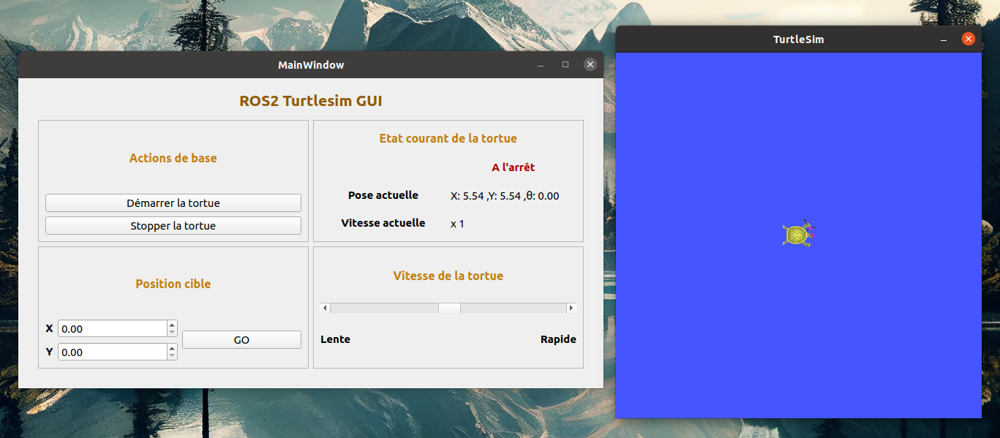

# Interface pour ROS2 Turtlesim

## Description
Ce projet est une application Qt qui interagit avec un nœud Turtlesim ROS2. Il permet aux utilisateurs de contrôler le mouvement d'une tortue dans l'environnement Turtlesim en utilisant une interface graphique intuitive. 
L'application permet de démarrer et d'arrêter le mouvement de la tortue, de la diriger vers une position cible, et de contrôler la vitesse de déplacement

## Auteur
- Gaetan Chevalier [https://github.com/GaetanChvlr]

## Fonctionnalités
- **Actions de base** : Commencer ou arrêter le mouvement de la tortue.
- **Position cible** : Donner une consigne en position à la tortue.
- **Vitesse de la tortue** : Régler la vitesse de déplacement de la tortue.
- **Etat courant de la tortue** : Connaitre les informations de base sur la simulation en cours.

## Prérequis
- ROS2 Foxy (ou une version plus récente)
- qt5-default (5.12.8 ou plus récent)

## Installation
1. Cloner le dépôt dans votre workspace ROS2.

2. Dans votre workspace ROS2, construire l'application en utilisant colcon.
``` 
colcon build --symlink-install
```

## Exécution
1. Pour lancer l'application, sourcer l'environnement de votre workspace.

```
source ros_ws/install/setup.bash
``` 

2. Exécuter la commande de lancement :

```
ros2 run ros2_turtle_gui turtlesim_gui
```

## Utilisation de l'interface
- Lancer l'application.
- Utiliser les boutons "Démarrer" et "Stopper" pour contrôler le mouvement de la tortue, sur une trajectoire circulaire simple.
- Entrer les coordonnées X et Y pour la position cible et cliquer sur "Go" pour déplacer la tortue vers cette position.
- Faire varier le curseur pour modifier la vitesse de la tortue.

## Aperçu de l'Application

